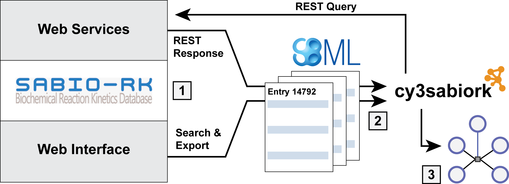
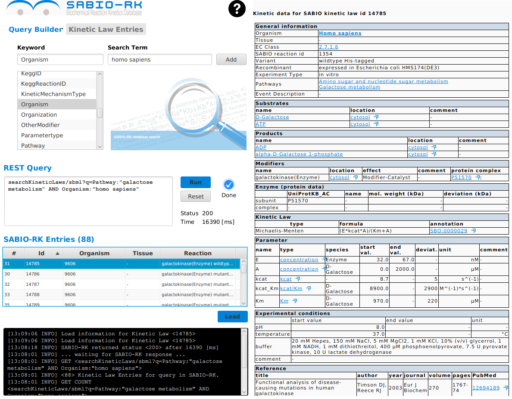
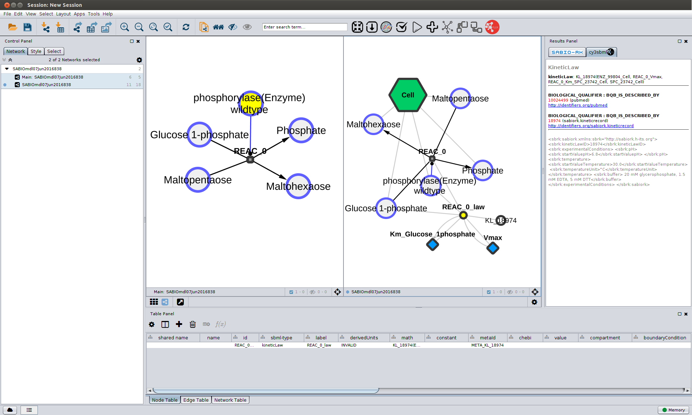
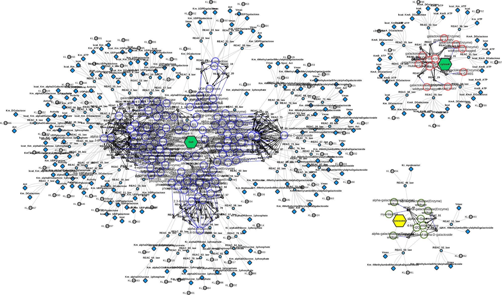

# cy3sabiork: SABIO-RK for Cytoscape 3
[](https://zenodo.org/badge/latestdoi/5066/matthiaskoenig/cy3sabiork)
<a href="https://www.paypal.com/cgi-bin/webscr?cmd=_s-xclick&amp;hosted_button_id=RYHNRJFBMWD5N" title="Donate to this project using Paypal"></a>
[](https://travis-ci.org/matthiaskoenig/cy3sabiork)
[](https://codecov.io/gh/matthiaskoenig/cy3sabiork)
[](https://badge.fury.io/gh/matthiaskoenig%2Fcy3sabiork)
[](http://opensource.org/licenses/GPL-3.0)

**cy3sabiork** is a [Cytoscape 3](http://www.cytoscape.org) app for accessing kinetic information from [SABIO-RK](http://sabio.villa-bosch.de/) via the RESTful web service.
  
[](http://sabio.villa-bosch.de/)  

  
**Figure 1**: Workflow overview.

**App Store**: http://apps.cytoscape.org/apps/cy3sabiork  
**Support & Forum**: https://groups.google.com/forum/#!forum/cysbml-cyfluxviz  
**Issue Tracker**: https://github.com/matthiaskoenig/cy3sabiork/issues   
**Tutorial**: [cy3sabiork Tutorial](docs/Tutorial.md) 

## License
* Source Code: [GPLv3](http://opensource.org/licenses/GPL-3.0)
* Documentation: [CC BY-SA 4.0](http://creativecommons.org/licenses/by-sa/4.0/)

## Install
**cy3sabiork** is available via the [Cytoscape App Store](http://apps.cytoscape.org/apps/cy3sabiork).
* install [Cytoscape v3.5.1](http://www.cytoscape.org/download.html) or higher
* install cy3sbml and cy3sabiork via the app store  
`Apps -> App Manager`

For a manual install
* download latest versions of [cy3sbml](https://github.com/matthiaskoenig/cy3sbml/releases/latest) and [cy3sabiork](https://github.com/matthiaskoenig/cy3sabiork/releases/latest)  
`cy3sbml-vx.x.x.jar`  
`cy3sabiork-vx.x.x.jar`  
and move the downloaded jar files in the Cytoscape app folder
`CytoscapeConfiguration/3/apps/installed/`

## How to cite
**König M.** cy3sabiork: A Cytoscape app for visualizing kinetic data from SABIO-RK [version 1; referees: awaiting peer review]. F1000Research 2016, 5:1736 (doi: [10.12688/f1000research.9211.1](http://dx.doi.org/10.12688/f1000research.9211.1)) 

## Screenshot
  
**Figure 2**: GUI overview.

  
**Figure 3**: Reaction kinetic networks based on SABIO-RK RESTful queries. cy3sbml provides access to annotation information.

  
**Figure 4**: Reaction kinetic network for Human galactose metabolism.

## Build instructions
Clone the repository and build with `maven`
```
git clone https://github.com/matthiaskoenig/cy3sabiork.git
cd cy3sabiork
mvn clean install cy3sabiork
```
Development is done in `develop` branch, documentation in `gh-pages`
```
git checkout -b develop --track origin/develop
git checkout -b gh-pages --track origin/gh-pages
```

## Acknowledgments
**cy3sabiork** was developed by [Matthias König](https://www.livermetabolism.com/contact.html) within the Virtual Liver Network (VLN) and the Systems Medicine of the Liver (LiSyM).  
This work was supported by the Federal Ministry of Education and Research (BMBF, Germany) within the research network Systems Medicine of the Liver (LiSyM) [grant number 031L0054] and the Virtual Liver Network VLN [grant number 0315741].

<a href="http://sabio.villa-bosch.de/"></a>&nbsp;&nbsp;
<a href="http://network.virtual-liver.de/en/"></a>&nbsp;&nbsp;
<a href="http://network.virtual-liver.de/en/"></a>&nbsp;&nbsp;
<a href="http://www.cytoscape.org/"></a>&nbsp;&nbsp;
<a href="http://sbml.org/Main_Page"></a>&nbsp;&nbsp;
<a href="http://www.bmbf.de/"></a>&nbsp;&nbsp;

We thank the SABIO-RK team for their support. We thank the SBML and Cytoscape community for their support and help.

## Change Log
**v0.4.0** [?]

**bug fixes**  
- [#41](https://github.com/matthiaskoenig/cy3sabiork/issues/41) icon bug Cy36 


**v0.3.5** [2017-10-18]

- update of library dependencies
- bugfixes & cy3sbml update

**v0.3.3** [2016-07-11]

- bug fixes & cy3sbml update
- release for zenodo DOI

**v0.3.2** [2016-07-01]

- fixes SBML reading bug on Windows

**v0.3.1** [2016-06-28]

- JavaFX based GUI
- autocomplete fields with suggestions
- WebView for Kinetic Information
- Query results window
- Full support of web services
- SBML information parsed in results table
- multiple bug fixes
- updated JSBML dependencies

**v0.3.0** [2016-06-07]

- ported to Cytoscape 3
- updated documentation

**v0.2.0** [2015-10-27]

- migration to github
- cy2sbml-v1.4.0

**v0.17**

- logger updated 

**v0.16**

- update library dependecies -> jersey-1.17.1

**v0.15**

- first working version
